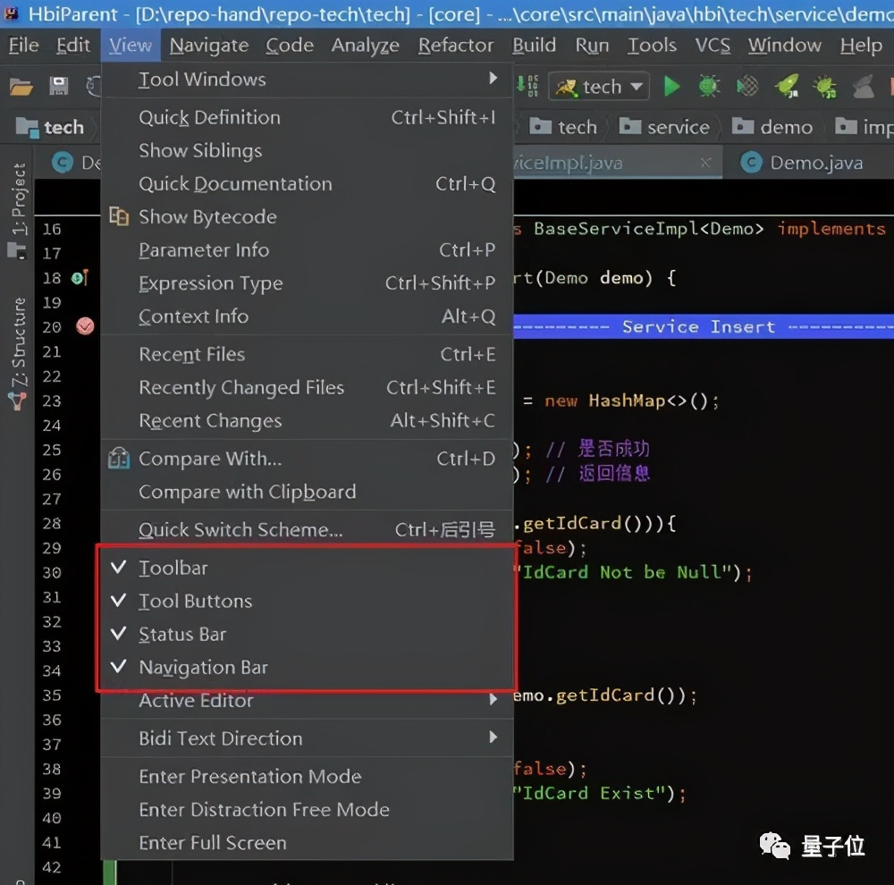

# Debug无忧！清华校友打造编程神器：反向追踪变量、数据流等 #

> 贾浩楠 发自 凹非寺
> 
> 量子位 报道 | 公众号 QbitAI
> 
> 写代码时提笔千行，debug时却低效抓狂……

几乎每个编程者都逃不了这样的纠结。

通过编译器一行行地去找bug，太浪费时间。



所以，一位清华校友、谷歌工程师laike9m，便开发了一个强大的Python调试工具Cyberbrain：

> 能够详细记录项目数据流、变量、状态等等关键信息。

并且，结果还会以直观简洁的可视化图片呈现。

有了这个神器，今后debug也会和写代码一样流畅高效。

## “赛博大脑”帮你debug ##

平常你的程序中出现bug时会怎么办？

最常规的办法是用调试器，但是你能记住程序中每个步骤发生什么了吗？

这就是传统方法的缺点：调试信息无法持久化，要靠程序员去记住它们。

这款名叫Cyberbrain（赛博大脑）的强大的工具，最亮眼的功能，是回溯代码中的变量更改历史，查看程序执行的状态。


所以，在你调试程序或debug时，不需要费几个小时用编译器逐行执行。

Cyberbrain会清晰的告诉你流程中都发生过什么：


Cyberbrain能显示准确的数据流，并保留程序的每个状态。程序员不仅不需要记住任何内容，甚至不需要逐步执行程序，这可以节省大量调试时间。

比方说，你想找出为什么返回值是错误的。通过看图，就可以对导致返回值的原因有了一个大概的了解。

接下来，将鼠标悬停在 “返回 “节点上，所有相关的值都显示出来了，形成了一个从函数开始到结束的跟踪路径：


只要动动鼠标就能找到问题，谁还会去用麻烦的编译器呢？

除了流程和变量跟踪，赛博大脑还能对目标进行检查。

如果现在有一个大列表，但它无法与图匹配，如何使用工具来检查它的值？

启动后，Cyberbrain会自动打开一个devtools窗口。

当你把鼠标悬停在一个变量上时，它的值就会被记录在devtools控制台中。

所以在这种情况下，虽然没有足够的空间在跟踪图中显示整个列表，但你仍然可以从devtools中检查它的值。


几乎所有的Python调试器(PyCharm、VS Code等)都会截断参数，无法显示一个大列表中的每个元素，但Cyberbrain不会这样做，除非你明确告诉它。

最后，Cyberbrain还能让用户在debug的同时，设置循环计数器。


## 如何安装使用 ##

Cyberbrain由一个Python库和各种编辑器/IDE集成组成。目前它支持 VS Code 和 Gitpod。

安装只需要通过一句话指令：

```
pip install Cyberbrain
code —install-extension laike9m.Cyberbrain
```

同时，作者还提供了在线版的Cyberbrain，可以直接试用：

	https://gitpod.io/#snapshot/91475a9d-4ccf-420a-b0ee-11db084ce689

在使用过程中，假如你想追踪一个函数“foo”，可以使用@trace指令实现：

```
from Cyberbrain import trace


# As of now, you can only have one @trace decorator in the whole program.
# We may change this in version 2.0, see https://github.com/laike9m/Cyberbrain/discussions/73


@trace  # Disable tracing with `@trace(disabled=True)`
def foo():
```

Cyberbrain可以保持你的工作流程不变。运行一个程序（从 vscode 或命令行，都可以），一个新的面板将被打开，程序执行情况全部以可视化展示：


使用Cyberbrain，还有几点需要注意。

首先是可能会与其他调试器发生冲突。如果你设置了断点并使用VSC的调试器，Cyberbrain可能无法正常工作。一般来说，首选 “不调试运行”。

而当你的程序中有多个装饰器（decorator）时，应该将@trace设置为最底层的那个。

此外，目前Cyberbrain还不支持多线程代码。

## 作者介绍 ##

作者laike9m，谷歌软件工程师，目前全职开发Cyberbrain工具。

laike9m是清华校友，在博客中自述曾担任清华大学推理协会会长。此外还是重度二次元爱好者。

除了Cyberbrain，他还组织了一档播客节目，名字叫捕蛇者说，Pythonhunter。

图片: https://uploader.shimo.im/f/Ks0rqxVvzEZrPsfE.png

Cyberbrain项目地址：

https://github.com/laike9m/Cyberbrain

laike9m主页：

https://laike9m.com/blog/

播客地址：

https://pythonhunter.org/